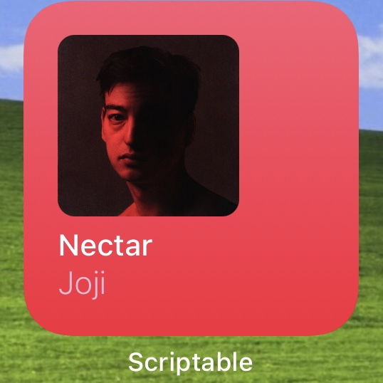
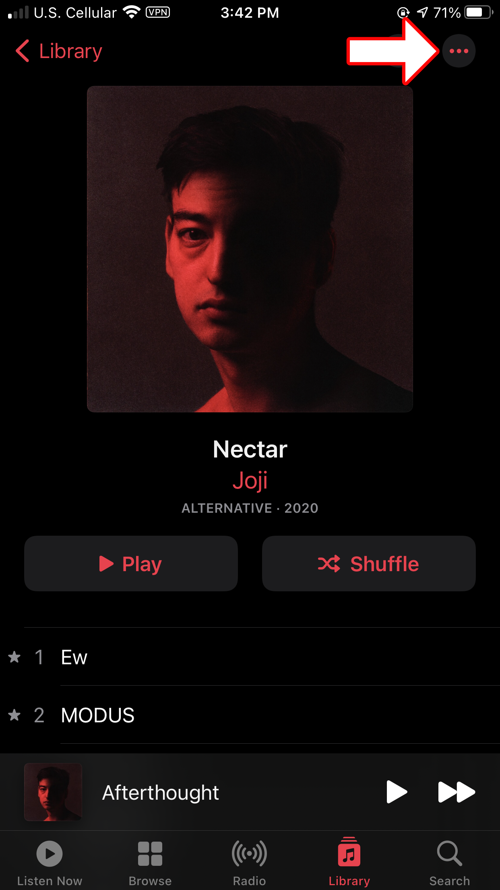
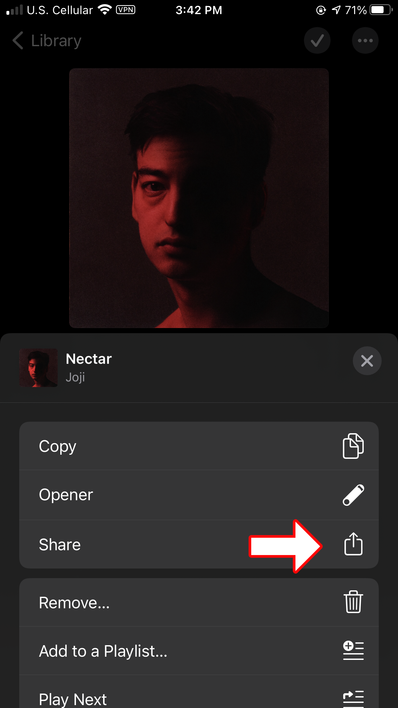
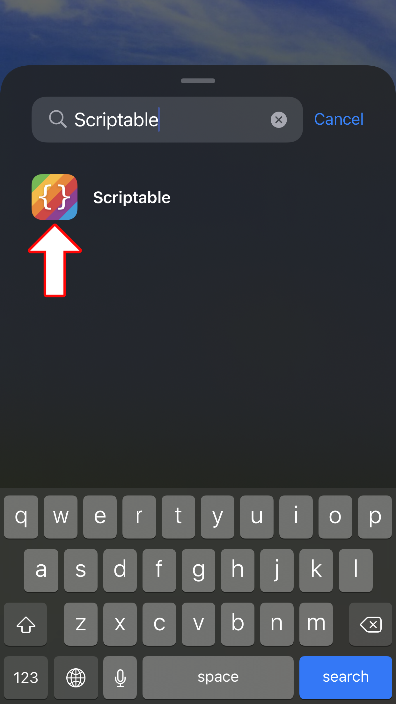
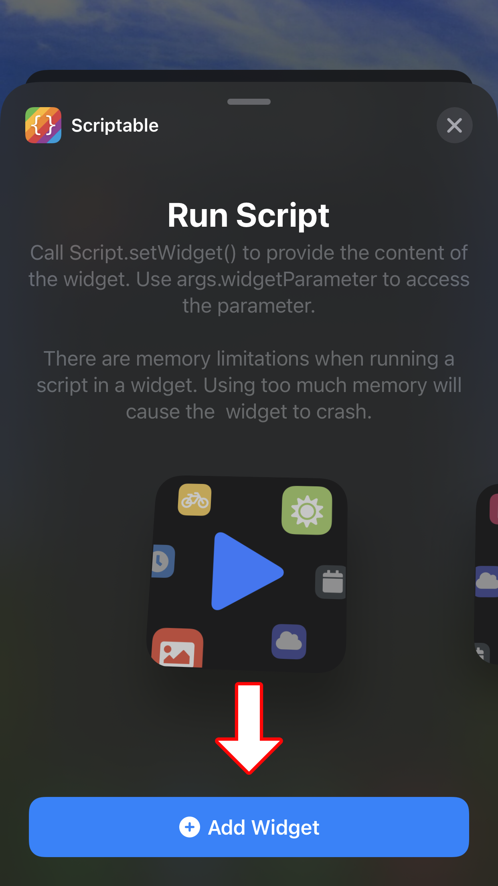
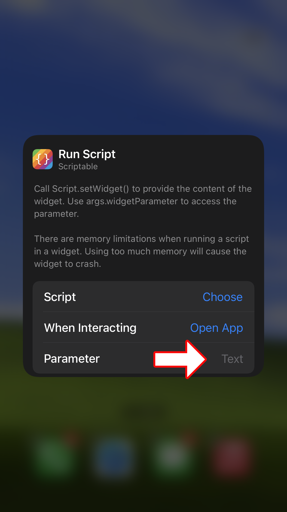
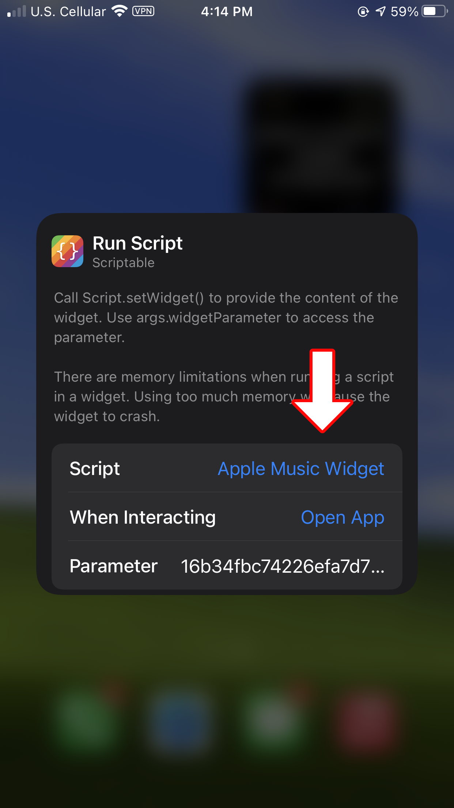

# Apple Music Widget
Apple Music Widget built in Scriptable for iOS
## What is it?
This is a script for the iOS app, [Scriptable](https://apps.apple.com/us/app/scriptable/id1405459188) which creates a widget. I'm trying to get the widget design to look as close as it can to the stock music widget, while providing a little more customization on how it's used.

Currently the widget supports songs, albums, and Apple Music playlists. Apple Music playlists are playlists that consist only of songs that can be found on Apple Music. This widget does not support songs, albums, or playlists that contain media uploaded from iTunes or other sources.

As of right now, I only support the small (2x2) widget.
## How do I set it up?
### Step 0 - Requirements
Make sure you've installed both [Scriptable](https://apps.apple.com/us/app/scriptable/id1405459188), and [Shortcuts](https://apps.apple.com/us/app/shortcuts/id915249334). These are the only two apps you will need.
### Step 1 - Installation
Add the helper Shortcut to your Shortcuts library. The easiest way to do this is by visiting [this iCloud link](https://www.icloud.com/shortcuts/b09317d3d98743bebd8f99e811b22fd8) on your iPhone.

You'll also want to add the widget script to your Scriptable library. You can create a new script in the app and then copy and paste [the script](https://raw.githubusercontent.com/heyitzspencer/scriptable-apple-music-widget/main/Apple%20Music%20Widget.js).
### Step 2 - Copy Link
Find the song, album, or playlist you want to use, and copy the link.

You can do this by tapping the three dots in the top right, tapping share, and then copy.
| Three Dots                    | Share                         | Copy                            |
| :---------------------------: | :---------------------------: | :-----------------------------: |
|  |  |  |
### Step 3 - Run Shortcut
Run the helper Shortcut and paste your link. The Shortcut should guide you from there :)
### Step 4 - Add Widget
To add a widget to your phone, tap and hold a blank space on one of your home screens. This will enter you into "jiggle mode". Tap the plus icon in the top right, then search for the Scriptable app. You'll want to choose the small (2x2) widget, as that is the only size supported at this time. Tap "Add Widget".
| Tap Plus (Jiggle Mode)       | Search "Scriptable"          | Add Widget (Small)             |
| :--------------------------: | :--------------------------: | :----------------------------: |
|  |  |  |
### Step 5 - Configure Widget
To configure your widget, stay in jiggle mode and tap the widget. This will open up the configurator menu. Paste your clipboard into the "Parameter" field, and choose the name of the script you added back in [Step 1](https://github.com/heyitzspencer/scriptable-apple-music-widget#step-1). You can ignore the "When Interacting" field.
| Tap Widget (Jiggle Mode)        | Paste Clipboard                 | Set Name                          |
| :-----------------------------: | :-----------------------------: | :-------------------------------: |
|  |  |  |
